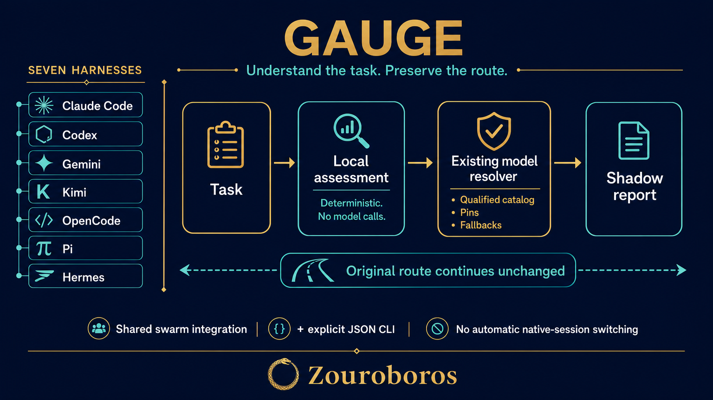

# Gauge

**Understand the task. Preserve the route.**



Gauge assesses task complexity locally and compares a model proposal through your existing Zouroboros swarm resolver. One shared integration serves Claude Code, Codex, Gemini, Kimi, OpenCode, Pi and Hermes. An explicit JSON CLI supports standalone sessions.

**Status: experimental, shadow only. The initial candidate was rejected for promotion.** Its held-out synthetic accuracy was 8/20 (40%), with 6 abstentions and zero exact matches on four complex tasks. Existing local and length-only baselines scored 5/20 and 4/20 on this cohort. Better aggregate scores do not establish useful routing quality. Nothing here switches production models.

## What it does

1. Assess the task using local deterministic rules and enum reason codes.
2. Map five assessment tiers to the resolver's four tiers (`apex` maps to `complex`).
3. Delegate model proposals to canonical registry/catalog exports. Gauge contains no model-selection table.
4. Record a bounded private shadow receipt while returning the original model unchanged.

Exact task selections, role selections, registry pins, qualification and fallback remain the resolver's responsibility. Gauge keeps the original resolver tier for task/role selections so an assessment cannot change their meaning. A pin is not evidence that a model passed qualification.

## Setup

Requires Linux, Bun (tested 1.3.12), GNU `timeout`, and an installed compatible Zouroboros swarm source package for model proposals. No Jev, provider credentials, downloads or language-model calls are needed on the assessment path. Other operating systems are unverified.

```bash
git clone git@github.com:marlandoj/gauge.git
cd gauge
bun install
bun run typecheck
bun run test

bun scripts/install.ts --swarm-root /absolute/path/packages/swarm
bun scripts/install.ts --swarm-root /absolute/path/packages/swarm --apply
```

The installer defaults to a dry run, backs up the exact current orchestrator before mutation, preserves unrelated source, and makes no changes when already installed. It refuses an unfamiliar or partially installed source shape. It copies `integrations/task-assessment-observer.ts` and modifies only the shared `resolveModelFor` call. Rebuild/restart existing consumers through their normal deployment workflow; source edits do not update already-running or independently pinned runtimes.

If Gauge is not at `<workspace>/Skills/gauge`, set `GAUGE_ROOT` to its absolute location in the consumer environment. Set `GAUGE_SWARM_ROOT` to the canonical swarm package. `SWARM_EXECUTOR_REGISTRY` takes precedence over that package's bundled registry; the shared observer also supplies the actual selected executor entry. Resolver/catalog environment settings pass through unchanged.

## Use

```bash
echo '{"task_text":"Diagnose a distributed race condition","harness":"codex","current_tier":"trivial"}' \
  | GAUGE_SWARM_ROOT=/absolute/path/packages/swarm bun scripts/gauge.ts assess
```

Input: `task_text`, `harness`; optional `current_tier`, `current_model`, `task_model`, `role_model`. Harness IDs are `claude-code`, `codex`, `gemini`, `kimi`, `opencode`, `pi`, `hermes`. Insufficient context, unsupported harnesses or unavailable/incompatible resolver dependencies produce abstention and no invented replacement model. Assessment can still return a proposed tier when model resolution is unavailable.

`assess` prints JSON without saving a receipt. `observe` consumes the same input, writes a receipt and prints nothing. The shared adapter runs a separate worker with a 250 ms system timeout; timeout, invalid input, missing dependencies and logging failures leave the original return value unchanged. Operating-system process launch and scheduling overhead are additional; this is not a hard real-time guarantee.

## Modes and rollback

`GAUGE_MODE=shadow` is the default; `GAUGE_MODE=off` disables automatic observation. Unsupported modes, including `live`, do not activate the adapter. This release intentionally has no automatic routing mode because its candidate failed evaluation. Do not interpret a proposal as an instruction to change a model.

For immediate rollback, set `GAUGE_MODE=off` in the consumer's normal launch environment. For source rollback, remove the observer import and restore the original `resolveModelForExecutor(... )?.model` return from the install backup. Compare current source first; restoring an entire old backup could discard subsequent edits. Remove the copied observer only after removing its import. The installer prints the backup path; `GAUGE_BACKUPS` overrides the backup directory.

## Receipts and privacy

`GAUGE_HOME` defaults to `~/.gauge`, mode 0700. `digest.key` and `assessments.jsonl` are mode 0600. Task text and selected model strings are HMAC digests in receipts; reason codes and controlled route metadata are retained. CLI output includes the proposed model to answer an explicit diagnostic query. No raw tasks, excerpts, errors, prompts, credentials or private feedback are copied into this repository.

JSONL accepts records up to 8 KiB and stops appending at 4 MiB. It never deletes existing records. Archive the file through your normal private retention process to resume logging. A SQLite transaction serializes appends and releases automatically when a worker is killed. Key creation publishes a completed private file atomically; interruption can leave a private temporary key file but cannot publish a partial key. An invalid existing key holds logging until the operator restores or deliberately rotates it. Timed-out or capacity-limited observations may have no receipt.

## Evidence and boundaries

See [validation](docs/validation.md), [baseline](docs/baseline.md), [evaluation protocol](evaluation/PROTOCOL.md), and [editable workflow](docs/workflow.md).

- One frozen dataset: 60 development tasks and 20 held-out tasks, grouped by paraphrase before the split; 40 independent scenarios total.
- Agent-authored English labels are diagnostic, not human ground truth. Development accuracy was 100%; held-out accuracy fell to 40%, showing poor generalization.
- All seven identifiers are tested through the actual shared consumer and CLI. This is synthetic execution of routing code, not seven completed provider/model sessions.
- Native interactive model pickers and review commands are not intercepted. Existing processes and other pinned copies require normal deployment.
- The merged ZOU-1685 resolver and this host's older working resolver are tested separately. Installing Gauge does not deploy PR #779 or erase concurrent work.
- Portable CI runs hermetic tests. External resolver and consumer tests require `GAUGE_TEST_SWARM_ROOT`, optional `GAUGE_TEST_WORKING_SWARM_ROOT`, and `GAUGE_TEST_CONSUMER_ROOT` pointing to prepared source packages.

## Credit

Built by Marlandoj for Zouroboros. The original local tier-resolver and the shared swarm resolver/catalog supply the comparison baselines and model-selection authority. This work follows the engineering discussion prompted by [Elia Alberti's jev-rules](https://github.com/EliaAlberti/jev-rules) and [kerpopule/hermes-jev-skills](https://github.com/kerpopule/hermes-jev-skills). Gauge borrows the idea of bounded task assessment; it does not vendor their implementations or depend on Jev. Their authors retain ownership of their work. Workflow artwork was generated using fal.ai GPT Image 2 from an original Gauge brief.
