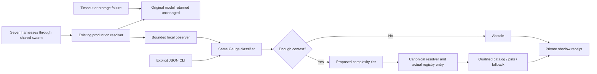

# Gauge workflow

No arrow from the proposal to production selection exists. The observer returns the previously computed model; it cannot authorize qualification, promote a catalog route or change a native session. Five assessment tiers map to four swarm tiers at the resolver boundary; apex maps to complex. V3 also failed the unchanged promotion gate. Its diagnostic and completed N01–N40 human review are documented in [the report](../evaluation/v3/REPORT.md) and [approval record](../evaluation/v3/APPROVAL.md). Earlier H01–H30 review is complete.
